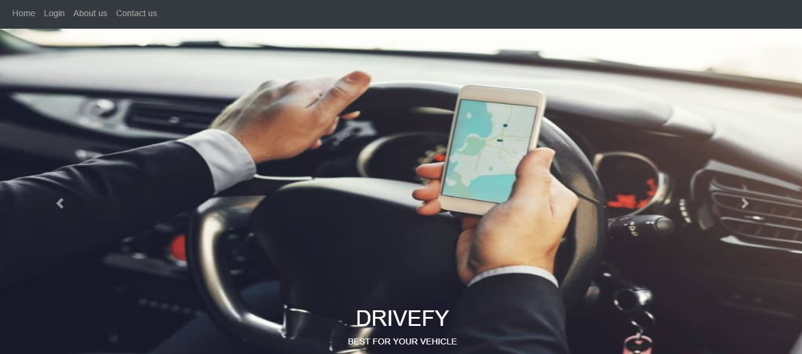
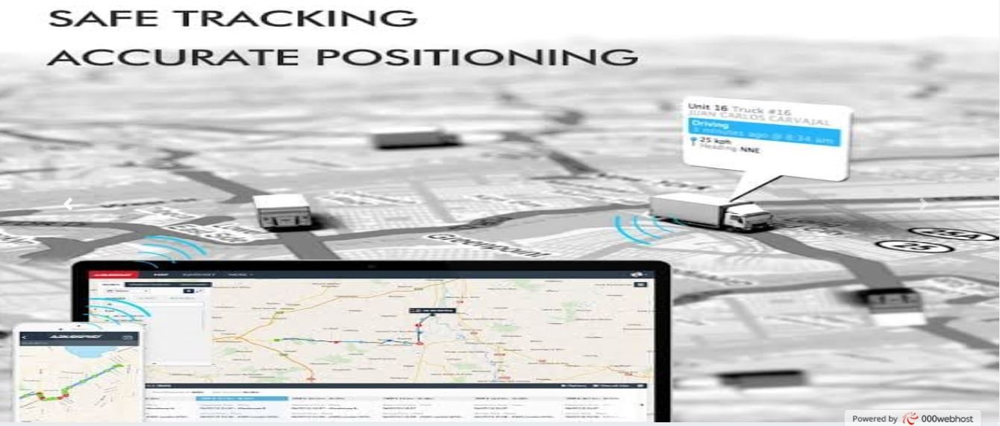
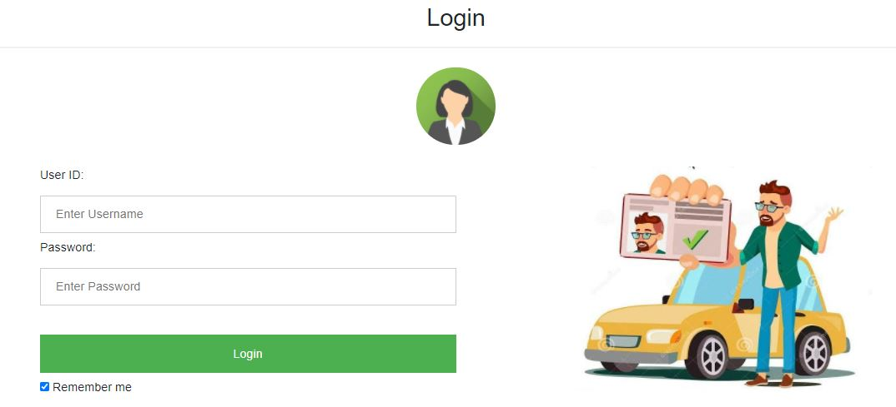
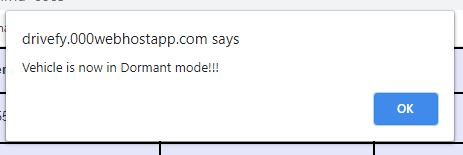
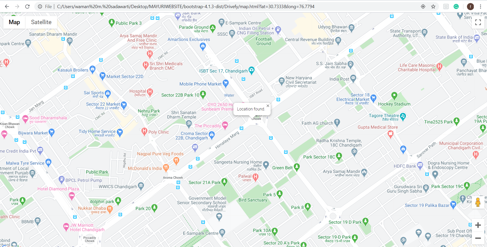
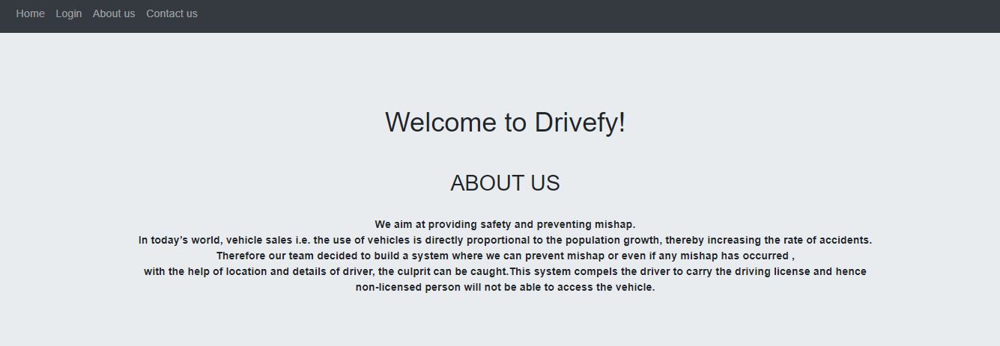
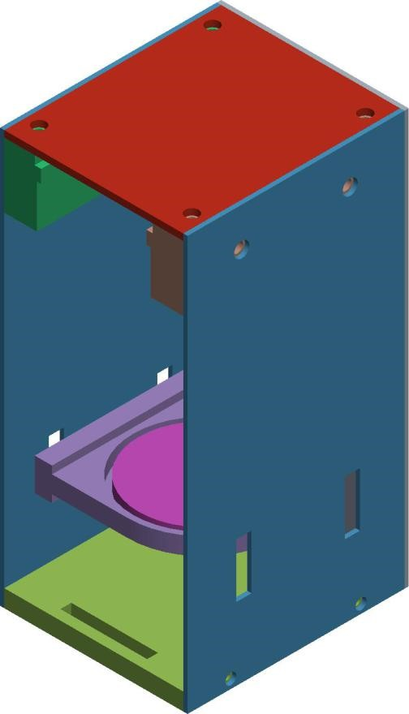

# Driver_Authentication_System

+ Driver authentication system enables only
authorized drivers to access the car using driver’s valid
license and biometric details
+ The idea is to prevent vehicle from igniting, if the
user is not possessing an valid id i.e license. After entering
the vehicle the driver will need to present his License in the device
Then it will ask to confirm your Biometrics After the
biometrics are confirmed the vehicle will start and entry
will be created in our database

+ Home

+ Login

+ Details of the person driving

+ The owner of the vehicle can lock the car in case of any mishap

+ Location

+ About Us

+ Fingerprint Model

